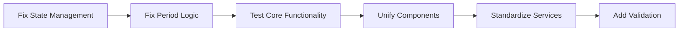

# Remediation Plan - Filtering Function Conflicts

**Audit ID**: 20250803-121426-custom  
**Generated**: Sun Aug 3 12:18:00 2025  

## Priority Matrix

| Priority | Count | Timeline | Owner |
|----------|-------|----------|-------|
| Critical | 0 | N/A | N/A |
| High | 2 | This Sprint | Dev Team |
| Medium | 2 | Next Sprint | Dev Team |
| Low | 1 | Backlog | Dev Team |

## Remediation Tasks

### High Priority Tasks (This Sprint)

1. **Consolidate Filter State Management**
   - Action: Refactor FilterContext to be single source of truth
   - Effort: High
   - Steps:
     1. Create clear state model for filters
     2. Remove conflicting state derivation
     3. Implement proper state update flow
     4. Add comprehensive unit tests

2. **Fix Period Determination Logic**
   - Action: Implement clear rules for period type determination
   - Effort: Medium
   - Steps:
     1. Define business rules for period selection
     2. Choose between selection-driven or period-driven approach
     3. Update FilterContext logic
     4. Update all dependent components

### Medium Priority Tasks (Next Sprint)

1. **Unify Filter Components**
   - Action: Create single, configurable filter component
   - Effort: High
   - Steps:
     1. Audit all existing filter components
     2. Extract common functionality
     3. Design flexible component API
     4. Migrate existing usages
     5. Deprecate old components

2. **Standardize Service Parameters**
   - Action: Use consistent filter parameter interface
   - Effort: Medium
   - Steps:
     1. Define FilterParams interface
     2. Update all service methods
     3. Update all service calls
     4. Add TypeScript types if applicable

### Low Priority Tasks (Backlog)

1. **Centralize Filter Validation**
   - Action: Create filter validation utility
   - Effort: Low
   - Steps:
     1. Extract validation logic from components
     2. Create validation utility module
     3. Add comprehensive validation tests

## Implementation Sequence

## Testing Strategy

1. **Unit Tests**: Filter state logic, period determination
2. **Integration Tests**: Filter + Service interaction
3. **E2E Tests**: User filter selection flows
4. **Regression Tests**: Ensure existing functionality preserved

## Success Metrics

- Zero conflicting filter states
- Single source of truth for filters
- Consistent behavior across all filter UI
- Reduced code duplication by 60%
- 100% test coverage for filter logic

## Integration with Dev Workflow

To create remediation epics:
1. For state management fix: `/dev-agent-bugfix "Consolidate filter state management to fix conflicts"`
2. For component unification: `/dev-agent-enhance "Unify filter components into single implementation"`
3. For service standardization: `/dev-agent-refactor "Standardize filter parameter interface"`

## Verification Steps

After each remediation:
1. Run tests: `/dev-agent-test "filter functionality"`
2. Re-run audit: `/dev-agent-audit --type "custom" --scope "filtering function conflicts"`
3. Verify no regressions in existing features
4. Update documentation

---
*Generated by dev-agent-audit*
